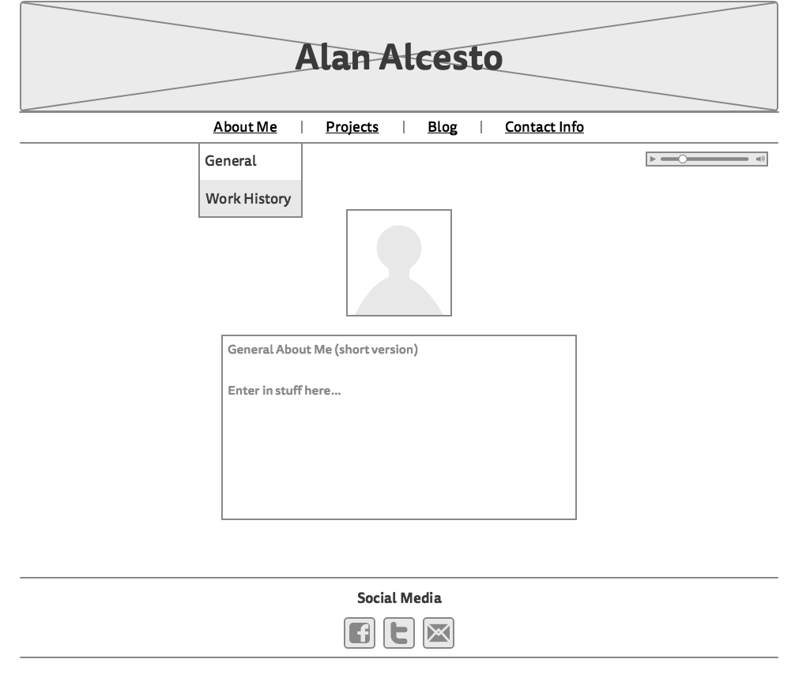

Blog Wireframe

Website Wireframe

What is a wireframe?

A wireframe is essentially a blueprint or sketch of a screen design and layout.

What are the benefits of wireframing?

Wireframing allows you to define how you want to portray and provide information through your design, making it easier for you to plan the layout according to how you want your user to process the information.

Did you enjoy wireframing your site?

I did enjoy wireframing my site. It gave the chance to be creative when planning the layout of my site.

Did you revise your wireframe or stick with your first idea?

I stuck with my original idea.

What questions did you ask during this challenge? What resources did you find to help you answer them?

I found myself asking, "Is the layout of my site User-Centered?" and "What makes a site Popular". For my first question I referred to the article "What is User Experience Design," provided in a previous assignment. To answer my question I searched for lists of popular sites and blogs. After looking at some of the sites and blogs, I took notes on their layouts.

Which parts of the challenge did you enjoy and which parts did you find tedious?

I really enjoyed wireframing my blog and site. I did not any of the tasks tedious this time around. Instead, the instructions were more concise and straightforward.
