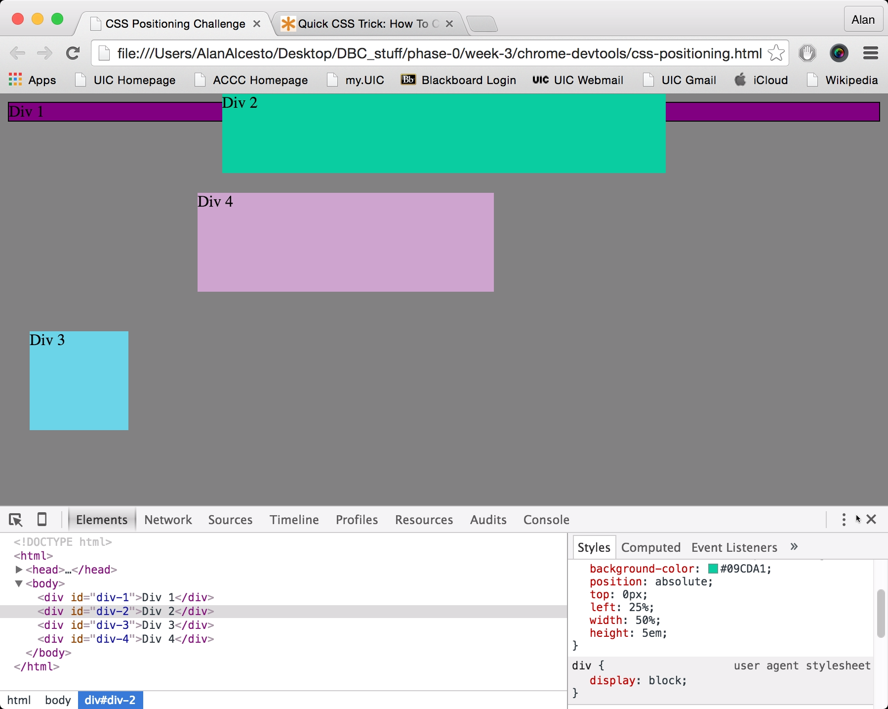

How can you use Chrome's DevTools inspector to help you format or position elements?

It gives you a live-time visual on the changes you are making in concerns to positioning and/or formatting elements on a website. This way you can see how positioning an element will look on the website, then you can apply more permanent changes to your CSS file to reflect the desired positioning.

How can you resize elements on the DOM using CSS?

Depending on the positioning, you can use px, em, or percentages to resize elements. Again, you want to use the best size element that caters to the positioning.

What are the differences between Absolute, Fixed, Static, and Relative positioning? Which did you find easiest to use? Which was most difficult?

Static is the default value, where the element goes in the order of the document flow. Absolute positions the element relative to the first element that is not static. Fixed positions the element in concerns to the browser window. Relative positions the element relative to the initial position. I feel like the relative positioning was the hardest to use because a lot of times you need to estimate the amounts until the element is positioned exactly where you want it.

What are the differences between Margin, Border, and Padding?

In the metrics pane, the order goes padding > border > margin. Padding provides space between what you are editing and the border. The border outlines the element. Margins adjust the space surrounding your element.

What was your impression of this challenge overall? (love, hate, and why?)

I really liked the challenge. It gave me a lot of firsthand experience using devtools and outlined different tricks I can use for my own website in the future.